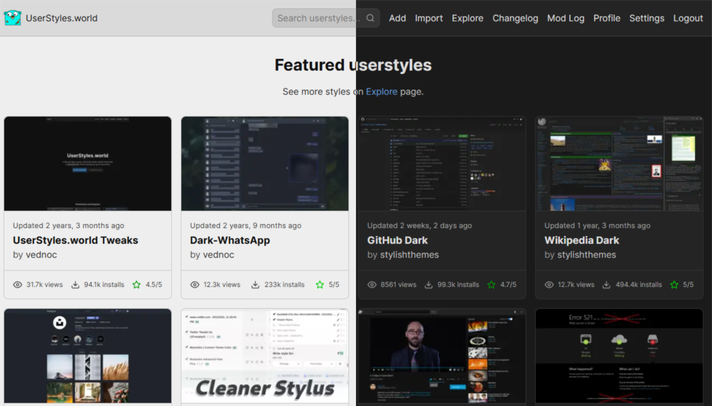

<!-- Hero/banner -->

  <a href="https://github.com/BlackSpirits/UserScripts-UserStyles/stargazers" rel="noopener noreferrer">
    <picture>
      <source srcset="./assets/readme-hero.webp" type="image/webp" />
      
    </picture>
  </a>

<!-- Repo status -->

  
  
  
  
  
  
  
  
  
  
  
  
  
  
  

  

  <b>Modern UserScripts and UserStyles focused on aesthetics, privacy, and UX.</b> 
  Catppuccin-based themes, ad-removal scripts, and layout enhancements for IMDb, UserStyles.world, Torrenting.com, and more.

  

## 📚 Table of Contents
- [Available Scripts & Styles](#-available-scripts--styles)
- [IMDb — Catppuccin Mocha Theme](#-imdb--catppuccin-mocha-theme)
- [UserStyles.world — Catppuccin Theme](#-userstylesworld--catppuccin-theme)
- [Installation](#-installation)
- [Browser support](#-browser-support)
- [Screenshots](#%EF%B8%8F-screenshots)
- [Releases](#%EF%B8%8F-releases)
- [Contributing & Feedback](#-contributing--feedback)
- [Support the project](#-support-the-project)
- [License](#-license)

## 📂 Available Scripts & Styles

| Name | Type | Description | Install |
|------|------|-------------|---------|
| **IMDb — Catppuccin Mocha Theme** | UserStyle | Elegant dark theme for IMDb based on the Catppuccin Mocha palette. |  |
| **UserStyles.world — Catppuccin Theme** | UserStyle | Catppuccin-based theme for UserStyles.world with full layout and contrast refinements. |  |
| **IMDb — Ad & IMDbPro Cleaner** | UserScript | Removes IMDb ads, IMDbPro upsell panels, and other clutter. |  |
| **Torrenting.com — Auto Posters** | UserScript | Displays posters in torrent listings with an optimized layout on Torrenting.com. |  |

<a href="#top">↑ Back to top</a>

  

## ✨ IMDb — Catppuccin Mocha Theme

**Features**
- Catppuccin Mocha palette applied across IMDb
- Transparent **hero rating bar** with unified hover/radius
- Styled header flyouts (User/Language) and **autosuggest**
- **Awards** highlights and consistent subnav spacing
- Unified link styling for “Cast & crew”, “Company credits”, “All topics”, “More from” — **peach** with **lavender** hover
- **Full Credits**: single container with soft dividers; actor (mauve), character (peach)
- **Filmography accordions**: transparent headers + single bottom divider
- Icon/ribbon contrast fixed on dark backgrounds

**Support**  
Bug reports and feature requests for this IMDb style can be submitted via  
[GitHub Issues](https://github.com/BlackSpirits/UserScripts-UserStyles/issues)

  
<b>Changelog (Latest: v2.7)</b>

    <ul>
    <li><b>v2.7</b>: Completed dark-mode coverage for Contribution & Help pages, improved metadata contrast.</li>
    <li><b>v2.6</b>: Refined Full Credits layout, improved Filmography accordions.</li>
    <li><b>v2.5</b>: Unified menu backgrounds, refined hover/focus states.</li>
    <li><b>v2.0</b>: Major refresh with Catppuccin Mocha palette.</li>
  </ul>
  
Full detailed changelog: <a href="https://userstyles.world/style/23644/imdb-catppuccin-mocha-theme">UserStyles.world</a>.

  

## ✨ UserStyles.world — Catppuccin Theme

**Features**
- Supports all Catppuccin variants (Latte, Frappé, Macchiato, Mocha)
- Unified cards, headers, and navigation styling
- Improved contrast and spacing for listings and metadata
- Consistent hover and focus states

  

## 🔧 Installation

### UserScripts (.user.js)
1. Install a manager: [Tampermonkey](https://www.tampermonkey.net/) or [Violentmonkey](https://violentmonkey.github.io/).
2. Click **Install** in the table above and confirm.

### UserStyles (.user.css)
1. Install [Stylus](https://add0n.com/stylus.html).
2. Click **Install** in the table above and enable the style.

  

### 🧭 Browser support
| Browser | UserScripts | UserStyles |
|---------|-------------|-----------|
| Chrome  | ✔️ Works (Tampermonkey / Violentmonkey) | ✔️ Works (Stylus) |
| Firefox | ✔️ Works | ✔️ Works |
| Edge    | ✔️ Works | ✔️ Works |
| Safari  | 🧪 Not tested (help wanted) | 🧪 Not tested (help wanted) |

Legend: ✔️ works · ⚠️ partial · 🧪 not tested · ✖️ no support  
Not affiliated with IMDb or Amazon. Trademarks belong to their owners.

  

## 🖼️ Screenshots

### IMDb — Catppuccin Mocha Theme

  
Before / After

| Before | After |
|---|---|
|  |  |

---

### UserStyles.world — Catppuccin Theme

  
Before / After

| Default | Catppuccin (Latte · Frappé · Macchiato · Mocha) |
|---|---|
|  |  |

<a href="#top">↑ Back to top</a>

  

## 🗒️ Releases
See **[Releases](https://github.com/BlackSpirits/UserScripts-UserStyles/releases)** for full change logs.

  

## 🛠️ Contributing & Feedback
- Found a bug or have a suggestion? Open an [issue](https://github.com/BlackSpirits/UserScripts-UserStyles/issues).
- Want to improve a script or add a new one? Send a pull request.

  

## ☕ Support the project

  

    
  
  
  
  

  

  

## 📜 License
Released under the [MIT License](./LICENSE).  
© 2025–2026 BlackSpirits. 
<a href="#top">↑ Back to top</a>

