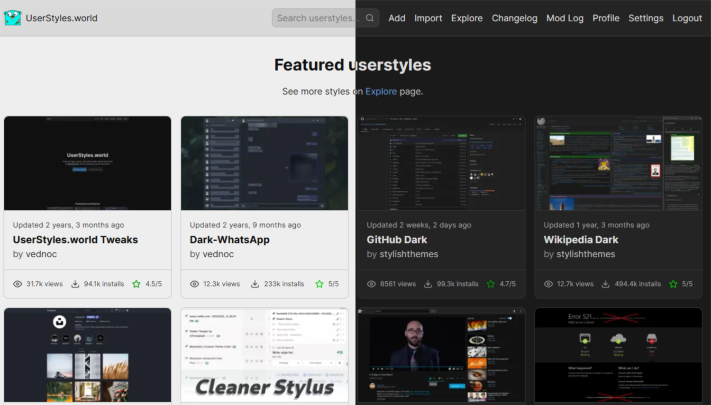
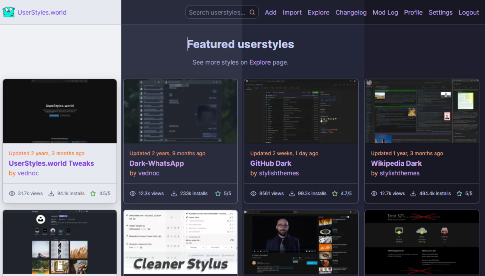

<!-- Hero/banner -->

  <a href="https://github.com/BlackSpirits/UserScripts-UserStyles/stargazers" rel="noopener noreferrer">
    <picture>
      <source srcset="./assets/readme-hero.svg" type="image/svg+xml" />
      
    </picture>
  </a>

<!-- Status badges -->

  
  
  
  
  

<!-- Donation badges -->

  
  
  
  
  

  <b>Modern UserScripts and UserStyles focused on aesthetics, privacy, automation, and UX.
  Catppuccin-based themes, cleanup scripts, and interface enhancements for IMDb, UserStyles.world, Torrenting.com, and more.

## 📚 Table of Contents

- [Available Scripts & Styles](#-available-scripts--styles)
- [IMDb — Catppuccin Mocha Theme](#-imdb--catppuccin-mocha-theme)
- [UserStyles.world — Catppuccin Theme](#-userstylesworld--catppuccin-theme)
- [IMDb — Ad & IMDbPro Cleaner](#-imdb--ad--imdbpro-cleaner)
- [Torrenting.com — Auto Posters](#-torrentingcom--auto-posters)
- [Installation](#-installation)
- [Browser support](#-browser-support)
- [Screenshots](#️-screenshots)
- [Contributing & Feedback](#️-contributing--feedback)
- [Support the project](#-support-the-project)
- [License](#-license)

## 📂 Available Scripts & Styles

| Name | Type | Description | Install |
|------|------|-------------|---------|
| **IMDb — Catppuccin Mocha Theme** | UserStyle | Elegant dark theme for IMDb using the Catppuccin Mocha palette. |  |
| **UserStyles.world — Catppuccin Theme** | UserStyle | Catppuccin theme for UserStyles.world with full layout and contrast refinements. |  |
| **IMDb — Ad & IMDbPro Cleaner** | UserScript | Removes IMDb ads, IMDbPro upsell panels, and layout clutter. |  |
| **Torrenting.com — Auto Posters** | UserScript | Displays posters in torrent listings with an optimised layout. |  |

<a href="#top">↑ Back to top</a>

## ✨ IMDb — Catppuccin Mocha Theme

Full dark theme for IMDb built on the **Catppuccin Mocha** palette.

**Features**
- Catppuccin Mocha palette applied across all IMDb pages
- Transparent **hero rating bar** with unified hover and border-radius
- Styled header flyouts (User / Language) and **autosuggest dropdown**
- **Awards** highlights and consistent subnav spacing
- Unified link styling for "Cast & crew", "Company credits", "All topics" — peach with lavender hover
- **Full Credits**: single container with soft dividers; actor names in mauve, character names in peach
- **Filmography accordions**: transparent headers with a single bottom divider
- Icon and ribbon contrast fixed for dark backgrounds

**Support**  
Bug reports and feature requests → [GitHub Issues](https://github.com/BlackSpirits/UserScripts-UserStyles/issues)

  
<b>Changelog (latest: v2.7)</b>

   
  <ul>
    <li><b>v2.7</b> — Completed dark-mode coverage for Contribution & Help pages; improved metadata contrast.</li>
    <li><b>v2.6</b> — Refined Full Credits layout; improved Filmography accordions.</li>
    <li><b>v2.5</b> — Unified menu backgrounds; refined hover and focus states.</li>
    <li><b>v2.0</b> — Major refresh with Catppuccin Mocha palette.</li>
  </ul>
  
Full detailed changelog: <a href="https://userstyles.world/style/23644/imdb-catppuccin-mocha-theme">UserStyles.world</a>

<a href="#top">↑ Back to top</a>

## ✨ UserStyles.world — Catppuccin Theme

**Features**
- Supports all Catppuccin variants: Latte, Frappé, Macchiato, Mocha
- Unified cards, headers, and navigation styling
- Improved contrast and spacing for listings and metadata
- Consistent hover and focus states throughout

<a href="#top">↑ Back to top</a>

## 🧹 IMDb — Ad & IMDbPro Cleaner

Removes ads, IMDbPro upsell banners, and layout noise from IMDb without breaking existing functionality.

**Features**
- Blocks ads and sponsored content (EN + PT variants)
- Strips IMDbPro upsell panels and prompts
- Safe-zone protection for credit accordions
- Throttled `requestAnimationFrame` for minimal performance impact

<a href="#top">↑ Back to top</a>

## 🎬 Torrenting.com — Auto Posters

Displays movie and series posters directly in torrent listings on Torrenting.com.

**Features**
- Supports all page types: featured, browse, requests, torrent details
- SVG placeholder for missing posters
- Lazy loading and async decoding for performance
- Same-origin fetch — no external requests

<a href="#top">↑ Back to top</a>

## 🔧 Installation

### UserScripts (.user.js)
1. Install a manager: [Tampermonkey](https://www.tampermonkey.net/) or [Violentmonkey](https://violentmonkey.github.io/).
2. Click **Install** in the table above and confirm in the manager dialog.

### UserStyles (.user.css)
1. Install [Stylus](https://add0n.com/stylus.html).
2. Click **Install** in the table above and enable the style.

<a href="#top">↑ Back to top</a>

## 🧭 Browser Support

| Browser | UserScripts | UserStyles |
|---------|-------------|------------|
| Chrome  | ✔️ Tampermonkey / Violentmonkey | ✔️ Stylus |
| Firefox | ✔️ Works | ✔️ Works |
| Edge    | ✔️ Works | ✔️ Works |
| Safari  | 🧪 Not tested | 🧪 Not tested |

Legend: ✔️ works · ⚠️ partial · 🧪 not tested · ✖️ no support 
Not affiliated with IMDb, Amazon, or Torrenting.com. Trademarks belong to their respective owners.

<a href="#top">↑ Back to top</a>

## 🖼️ Screenshots

### IMDb — Catppuccin Mocha Theme

  
Before / After

| Before | After |
|--------|-------|
|  |  |

### UserStyles.world — Catppuccin Theme

  
Before / After

| Default | Catppuccin (Latte · Frappé · Macchiato · Mocha) |
|---------|--------------------------------------------------|
|  |  |

<a href="#top">↑ Back to top</a>

## 🗒️ Releases & Changelog

See **[Releases](https://github.com/BlackSpirits/UserScripts-UserStyles/releases)** for full change logs or browse [CHANGELOG.md](./CHANGELOG.md) for detailed version history.

<a href="#top">↑ Back to top</a>

## 🛠️ Contributing & Feedback

- Found a bug or have a suggestion? Open an [issue](https://github.com/BlackSpirits/UserScripts-UserStyles/issues).
- Want to improve a script or add a new one? Read the [Contributing Guide](./CONTRIBUTING.md) and send a pull request.

<a href="#top">↑ Back to top</a>

## ☕ Support the project

If this saves you time or makes your browsing better, a coffee is always appreciated.

  
  
  
  
  

## 📜 License

Released under the [MIT License](./LICENSE).  
© 2025–2026 [BlackSpirits](https://github.com/BlackSpirits).

<a href="#top">↑ Back to top</a>

